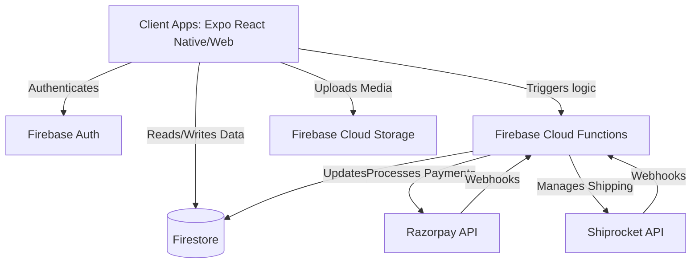

# Project Overview: TafDeal

## High-Level Business Goal
TafDeal is a scalable, modular e-commerce platform designed to facilitate seamless transactions between customers and sellers. It provides a robust marketplace ecosystem catering to multiple user roles.

## User Flows

### Customer
- **Discovery**: Browse categories, search for products, view detailed product pages.
- **Purchase**: Add to cart, proceed to checkout, select payment method, and place orders.
- **Post-Purchase**: Track order status, request returns/exchanges, and manage account details.

### Vendor/Seller
- **Onboarding**: Register as a seller, complete KYC/business verification.
- **Inventory Management**: Add, update, and manage products, stock levels, and pricing.
- **Order Fulfillment**: View incoming orders, process shipments, and manage returns.
- **Analytics & Payments**: View sales dashboards, monitor settlements, and track revenue.

### Admin
- **Platform Management**: Approve/reject sellers, monitor platform health.
- **Catalog Moderation**: Review product listings for policy compliance.
- **Customer Support**: Handle escalations, view user activity, and resolve disputes.

## Core Tech Stack
- **Frontend**: React / React Native (Expo) - Mobile & Web interface.
- **Backend**: Firebase Cloud Functions (Node.js/TypeScript).
- **Database**: Firebase Firestore (NoSQL).
- **Authentication**: Firebase Authentication.
- **Payment Gateways**: Razorpay, standard banking/UPI integrations.
- **Logistics**: Shiprocket (via MCP).
- **Hosting/Cloud**: Firebase Hosting.

## System Architecture

